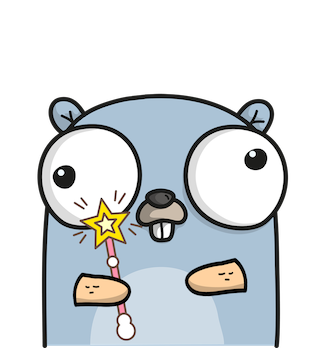
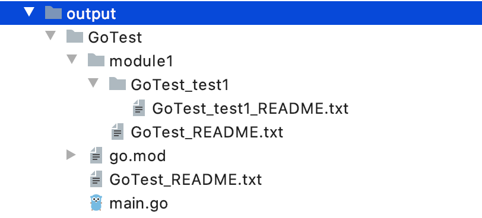

# gogen
A simple CLI and library to generate any kind of projects from any kind of templates! (just like maven archetype, but its much easier)

There is absolutely no limitation in programming language or whatever you want to generate from a file and directory based template!

## Features
- Generating output from any kind of folder/file structure
- Uses the famous [Mustache](https://mustache.github.io/) templating engine for directory name, file name, file content generation

## Options
```
./gogen generate --help
Generating projects/folder structures based on a template

Usage:
  gogen generate [flags]

Flags:
  -h, --help                  help for generate
  -o, --output-dir string     Output folder where result files will be generated
  -t, --template-dir string   Template folder to be used for generation
  -v, --vars stringToString   Variables for generation (default [])
```
You can use everything in directory/file names and files content that can be done in [Mustache](https://mustache.github.io/) (for loops etc...)

**Note**: Here when you pass any variables to the generator, they will be used for generating both folder/file names and contents of files!

## Example usage using CLI
- Build the CLI using the following command executed in root of the project: `go build`

- Then simply run an example:
```
./gogen generate -t examples/simple-project/ -o output/GoTest -v module=GoTest -v project_name="Go Test"
```

- Finally see the output folder that was generated (and also check for file contents):



